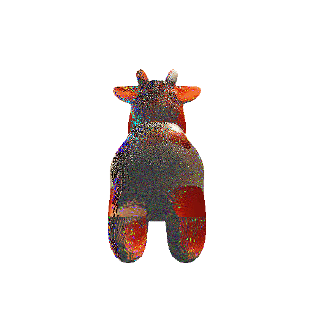
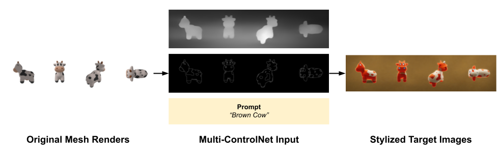
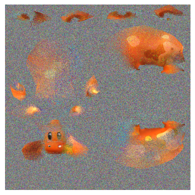

# Painting 3D Objects with Generative AI

**Generate custom textures from text prompts!**

<table style="padding:10px">
  <tr>
    <td height= "200px"> </td>
    <td height= "200px">
  </tr>
  
   <tr>
    <td><i>"Iron Man Inspired"</i></td>
   <td><i>"Brown Cow"</i></td>
  </tr>
</table>

This is an exploration into leveraging Generative AI models to craft 3D texture maps based on text prompts. These AI-generated textures can offer stylization and personalization, enabling swift coloring of 3D game assets. 

This project utilizes `PyTorch3D`, a 3D data library enabling advanced computer graphics tasks such as rendering and texture mapping. Additionally, it uses `OpenCV` and the `StableDiffusionControlNet` pipeline to generate stylized images of our mesh. These images are subsequently used to iteratively fit a **texture map** using an optimization loop.

This process is summarized in the figure below:

### Get Started

[Google Colab Notebook](https://colab.research.google.com/drive/1BUOxNyuMiDIokIS5tsBP6QS-iCpbmUX8?usp=sharing) 

### Approach
#### Target Image Generation using Multi-ControlNet

ControlNet conditioning is used for text-to-image generation, resulting in target images that will be reconstructed into a texture map in the next step. 

ControlNet, an extension of stable diffusion models, offers the ability to precisely control the generation area, incorpotating spatial context. This approach uses Multi-ControlNet, stacking multiple conditionings like Canny edge and depth maps to enhance the produced images.

#### "Texture Baking" with an Adam Optimizer 

The texture map is predicted by observing the target images generated by ControlNet. Starting with random noise, it learns the correct RGB colors such that a rendered image using the predicted mesh is iteratively more similiar to the target image.

Optimization Loop:
1. Render the mesh with the predicted map from the same camera angle as the target image.
2. Compare the rendered image and target image to compute RGB loss. 
3. Backpropgate to update texture map based on loss. 

> The diagram above represents 2D optimization, using a single view to predict the texture map. The same approach applies for 3D optimization. Loss is calculated as a weighted average of the different view's RGB loss.

### Results
<table style="padding:10px">
  <tr>
    <td width="50%"  height= "200px" > </td>
   <td width="50%" height= "200px" ></td>
  </tr>
  
   <tr>
    <td><i>Texture Map</i></td>
   <td><i>3D Render</i></td>
  </tr>
</table>

### Future Directions
**Texture Map Denoising** - 
The resultant texture map is still quite noisy, even in areas that are well represented in target images. Applying image processing techniques such as denoising or interpolation in post processing can refine the texture map significantly.

**Character Consistency with Stable Diffusion** - 
One source of doubt when learning colors from generated target images is when the images look different from various views. For instance, the back of an object might appear a different color in a side view compared to a top view. Introducing character consistency during image generation can help address this issue. Combining ControlNet with models like DreamBooth or LoRA has proven effective in generating different images with consistent character appearances.

## Acknowledgements
I had an opportunity to work on this project during my 8-week micro-internship at [Hypothetic.AI](https://www.hypothetic.art/), facilitated by [OpenAvenues](https://www.openavenuesfoundation.org/micro-internships). 

Thank you to Pablo Weidemann, CTO of Hypothetic, for his guidance and mentorship as our Project Leader. This project provided me a great opportunity to blend my interests in computer graphics and machine learning, fostering technical growth and exploratory learning. 

<!-- TODO: List any blog posts, tutorials or plugins that you may have used to complete the project. Only list those that had a significant impact. Obviously, we all 'Google' stuff while working on our things, but maybe something in particular stood out as a 'major contributor' to your skill set for this project. -->